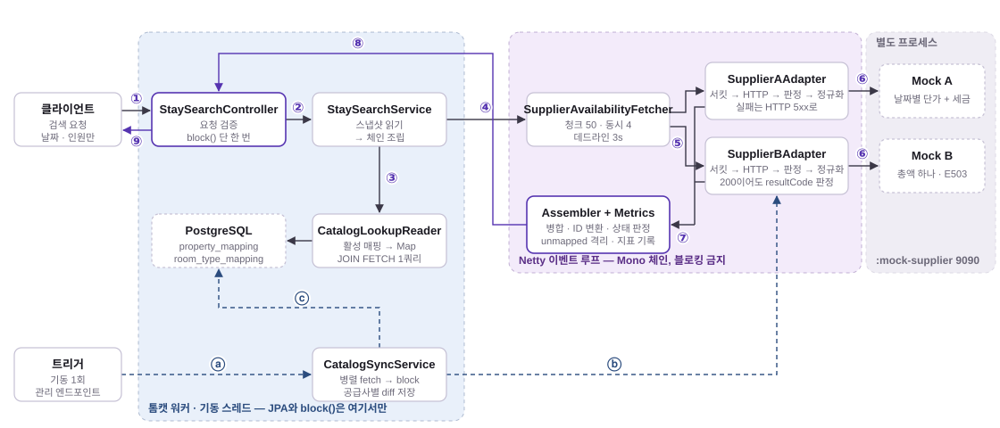

# 숙박 상품 통합 연동 백엔드

여러 외부 숙박 공급사(Supplier)의 상품을 하나의 표준 모델로 통합해 **단일 검색 API**로 제공하는 시스템.

공급사마다 요금 표현·세금 처리·실패 표현 방식이 다르다. 고객은 상품이 어디서 왔는지와 무관하게
같은 형태의 결과를 봐야 한다. 그리고 **외부 호출은 실패한다는 것**이 이 시스템의 전제다.

**현재 상태**: 핵심 흐름(Mock 공급사 → 카탈로그 동기화 → 어댑터 → 통합 검색 → 부분 실패 → 서킷 브레이커 → 지표)이 전부 구현되어 있고,
테스트 199개(`:app` 168 · `:mock-supplier` 31)가 통과하고, `docker compose --profile stack up --build` 한 줄로 전부 뜬다. 남은 것은 CI다(→ 운영 전제와 제한).

실행만 필요하면 `RUN.md`가 가장 짧다. 이 파일은 **왜 그렇게 만들었는지**를 적는다.

## 전체 그림 — 두 프로세스, 두 경로



①→⑨가 검색 한 건이고 보라색 선이 응답이 되돌아오는 길, 점선 ⓐ→ⓒ가 **요청 경로 밖**의 카탈로그 동기화다.
왼쪽 상자가 톰캣 워커(JPA와 `block()`은 여기서만), 가운데가 Netty 이벤트 루프(블로킹 금지), 오른쪽이 별도 프로세스인 Mock이다.
검색 경로는 ③에서 카탈로그 스냅샷을 한 번 읽은 뒤 DB를 다시 보지 않고, 동기화는 ⓑ에서 병렬 fetch를 `block()` 한 번으로 모은 뒤 ⓒ에서 공급사별 트랜잭션으로 저장한다.
단계별 클래스와 책임은 아키텍처 절의 "검색 한 건이 지나가는 길"에 있다.

## 요구사항 대조표

무엇을 어디서 답했는지 한 화면으로. §번호는 아래 "설계 의사결정"의 소제목이다.

| 요구 항목 | 어떻게 답했나 | 코드 · 테스트 | 근거 |
|---|---|---|---|
| 통합 상품 모델 | 요금 2계층 — `price`(필수, 총액·gross) + `priceDetail`(nullable). 조식은 객실이 아니라 요금 제안의 속성 | `supplier/port` · `SupplierANormalizerTest`·`SupplierBNormalizerTest` | §1, `docs/01` §3.2 |
| 공급사 코드 ↔ 내부 식별자 매핑 저장 | 유니크 키 (공급사, 숙소) · (공급사, 숙소, 객실). 사라진 상품은 삭제 대신 비활성화 — 재등장해도 같은 ID | `catalog/entity` · `MappingConstraintTest`·`CatalogSyncServiceTest` | §5·§6, `docs/04` |
| 숙소 목록을 언제 부르나 | 기동 시 1회 + `POST /admin/catalog/sync`. 정적 데이터는 고객 경로 밖에서 | `CatalogSyncRunner`·`CatalogSyncService` · `CatalogSyncWireTest` | §5 |
| 어댑터 경계 · 신규 공급사 추가 | 호출 → 판정 → 변환을 어댑터 안에서 완결. 경계 7규칙을 ArchUnit이 빌드에서 강제 | `supplier/adapter/{a,b}` · `SupplierAAdapterTest`·`SupplierBAdapterTest`·`ArchitectureTest` | 아키텍처, `docs/05` |
| 통합 검색 API | `GET /api/v1/stays/search` — 최소 계약 필드 전부 + 공급사별 결과·부분 실패 사실 | `search/` · `StaySearchControllerTest`·`StaySearchWireTest` | API, `docs/06` |
| 50개 제한 · 숙소 수천 개 | 50개 청크 · 공급사당 동시 4 · 데드라인 3s(도착한 청크는 살린다). 300숙소·6청크를 실제 HTTP로 확인 | `SupplierAvailabilityFetcher` · `SupplierAvailabilityFetcherTest`·`SearchScaleWireTest` | 수천 개로 늘면, `docs/06` §4 |
| 연박 재고 판정 · 예약 불가 노출 | 기간 내 날짜별 최솟값, 누락 날짜는 0. 응답에서 빼지 않고 0 + `available: false` | `InventoryRule` · `InventoryRuleTest` | §2·§3 |
| 견고성 — 병렬 · 타임아웃 · 부분 실패 · 판정 통일 | 연결 500ms / 응답 2s / 검색 3s. 실패는 예외가 아니라 값. A의 5xx와 B의 200+`E503`이 같은 `FailureKind` | `SupplierCallPipeline`·`SupplierWebClients`·`application.yaml` · `StaySearchWireTest`·`SupplierAdapterWireTest`·`FailureClassifierTest` | §4·§8 |
| Mock 공급사 — 정상·장애·무응답 | 별도 프로세스(9090), 모드는 (공급사 × API) 단위, 지연 모드와 합성 숙소 추가 | `:mock-supplier` · `MockSupplierContractTest` | Mock 절, `docs/03` |
| 설계 근거 문서 | 이 파일 + `docs/01`~`09` + `JOURNAL.md`. 적은 것이 코드에 있는지는 ArchUnit·와이어 테스트가 본다 | — | 문서 절 |
| 선택 — 서킷 브레이커 | **구현.** 공급사당 하나, 값으로 오는 실패를 `recordResult`로 센다 | `SupplierCallPipelines` · `SupplierCircuitBreakerTest`·`StaySearchWireTest` | §9, `docs/07` |
| 선택 — 정규화 실패 격리 | **구현(최소).** 항목 결함은 `rejected`로 격리·기록, 미매핑은 제외 + 카운터 | `AvailabilityResult`·`SearchResultAssembler` · `SearchResultAssemblerTest` | §8 |
| 선택 — 예약 대행 | **설계만.** 상태 머신 + 조정 작업. 검색과 달리 재시도가 옳은 자리 | — | `docs/09` |
| 선택 — 재시도 · 캐시 · 중복 병합 · 통화 | **안 함** + 이유 | — | 구현하지 않은 것 |
| 권장 — 테스트 · 과정 기록 · AI 기록 · API 문서 · 지표 · Resilience4j | 199개 · `JOURNAL.md` · `JOURNAL.md` AI 절 · springdoc 3.x · Micrometer 4지표 + 서킷 지표 · 코어 모듈 | — | 관측성 절 |

---

## 빌드 · 실행

**전제**: JDK 25, Docker Desktop 실행 중.
PostgreSQL은 Spring Boot Docker Compose Support가 `bootRun` 시 자동으로 띄운다(`compose.yaml`).
통합 테스트는 Testcontainers가 별도 컨테이너를 띄운다.

```bash
./gradlew build                     # 빌드 + 테스트 199개 (Docker 필요)
./gradlew :mock-supplier:bootRun    # 가짜 공급사 서버 (9090)
./gradlew :app:bootRun              # 본체 (8080) — 기동 시 카탈로그 동기화 1회
```

**둘 다 띄워야 검색이 동작한다.** Mock 없이 검색하면 전 공급사 연결 실패가 되는데,
이는 정상 동작(`status: ALL_FAILED`, HTTP 200)이지 버그가 아니다.

### Docker로 한 번에 (JDK 없이)

```bash
docker compose --profile stack up --build      # postgres + mock-supplier + app. 이미지 안에서 빌드한다
APP_PORT=18080 docker compose --profile stack up --build   # 호스트 8080이 이미 쓰이고 있을 때
docker compose --profile stack down
```

`compose.yaml` 하나가 두 가지로 쓰인다. `bootRun`은 프로파일 없는 `postgres`만 띄우고(Spring Boot Docker Compose Support),
`--profile stack`은 셋을 전부 띄운다. app·mock에 프로파일을 단 이유는 안 달면 `bootRun`이 컨테이너 app까지 띄워 8080을 먼저 잡기 때문이다.
컨테이너 안에서 `localhost`는 자기 자신이므로 공급사 주소는 `SUPPLIER_ENDPOINTS_{A,B}_BASE_URL=http://mock-supplier:9090`으로 덮는다.
app은 postgres·mock의 healthcheck를 기다린 뒤 뜨고, 기동 시 동기화가 컨테이너 안에서도 성공한다(숙소 3 · 객실 6).

| 모듈 | 포트 | 역할 |
|---|---|---|
| `:app` | 8080 | 통합 연동 백엔드 본체 |
| `:mock-supplier` | 9090 | 공급사 A·B의 API를 흉내내는 별도 서버. 정상·장애·무응답·지연 모드 |

**Mock을 별도 프로세스로 둔 이유** — 같은 프로세스에 두면 본체가 자기 자신을 HTTP로 호출한다. 무응답을 재현했을 때
그것이 공급사 지연인지 톰캣 스레드 고갈인지 구분할 수 없고, 연결 타임아웃 설정도 네트워크 경계를 넘지 않아 의미를 잃는다.

### 5분 시나리오 — 부분 실패와 서킷이 실제로 도는지

```bash
# 정상: 두 공급사 상품 6건, status OK
curl 'localhost:8080/api/v1/stays/search?checkIn=2026-09-01&checkOut=2026-09-04&adults=2&children=0'

# 공급사 B를 장애로 (B는 HTTP 200에 본문 코드 E503으로 실패를 알린다)
curl -X POST 'localhost:9090/control/b/mode?value=error&api=availability'

# 다시 검색: status PARTIAL, suppliers[b].failure.kind = SERVER_ERROR, items는 A 것 4건, Cache-Control: no-store
curl -i 'localhost:8080/api/v1/stays/search?checkIn=2026-09-01&checkOut=2026-09-04&adults=2&children=0'

# 열 번쯤 더 부르면 B의 서킷이 열린다 → suppliers[b].status = SKIPPED, detail "circuit open", B를 호출하지 않는다
curl 'localhost:8080/actuator/metrics/resilience4j.circuitbreaker.state?tag=name:b&tag=state:open'
curl 'localhost:8080/actuator/metrics/supplier.call?tag=supplier:b&tag=outcome:server_error'

# 복구. 10초 뒤 첫 검색이 반열림으로 넘기고, 세 번 성공하면 닫힌다
curl -X POST 'localhost:9090/control/reset'
```

무응답은 `value=no-response`, 지연은 `value=delay&delayMs=2500`. 현재 모드는 `GET localhost:9090/control`.

---

## API

### 검색

```
GET /api/v1/stays/search?checkIn=2026-09-01&checkOut=2026-09-04&adults=2&children=0
```

검색 조건은 **날짜와 인원뿐**이고 대상은 보유 숙소 전체다. 공급사가 지역 정보를 주지 않으므로 지역·키워드 필터, 정렬, 페이징은 다루지 않는다.

```json
{
  "status": "PARTIAL",
  "checkIn": "2026-09-01", "checkOut": "2026-09-04", "nights": 3, "adults": 2, "children": 0,
  "suppliers": [
    { "supplier": "a", "status": "SUCCESS", "calls": 1, "failedCalls": 0, "skippedCalls": 0, "elapsedMs": 84,
      "offers": 4, "rejected": 0, "unmapped": 0, "failure": null },
    { "supplier": "b", "status": "FAILED",  "calls": 1, "failedCalls": 1, "skippedCalls": 0, "elapsedMs": 61,
      "offers": 0, "rejected": 0, "unmapped": 0,
      "failure": { "kind": "SERVER_ERROR", "retryable": true, "detail": "E503 TEMPORARILY_UNAVAILABLE" } }
  ],
  "items": [
    { "propertyId": 1, "propertyName": "Riverside Hotel Seoul",
      "roomTypeId": 1, "roomTypeName": "Deluxe Twin", "maxOccupancy": 2,
      "availableRooms": 1, "available": true, "supplier": "a",
      "price": { "currency": "KRW", "totalAmount": 429000, "taxIncluded": true, "breakfastIncluded": false, "nights": 3 },
      "priceDetail": { "taxAmount": 39000,
        "nightlyBreakdown": [ { "date": "2026-09-01", "net": 120000, "tax": 12000, "remainingRooms": 3 }, "…" ] } },
    { "propertyId": 2, "roomTypeId": 4, "roomTypeName": "Standard Double", "availableRooms": 0, "available": false, "…": "…" }
  ]
}
```

| 항목 | 규칙 |
|---|---|
| `status` | `OK`(실패한 호출 없음) · `PARTIAL`(성공과 실패 혼재 — 공급사 간이든 청크 간이든) · `ALL_FAILED`(호출한 것이 전부 실패). **전 공급사 실패도 HTTP 200** |
| `suppliers[].status` | `SUCCESS` · `PARTIAL` · `FAILED` · `SKIPPED`(호출하지 않음 — 서킷 열림, 물어볼 숙소 없음). SKIPPED는 성공에도 실패에도 세지 않는다 |
| `failure.retryable` | 클라이언트가 "잠시 후 재시도"를 안내할 수 있는 유일한 근거 |
| `items` | (공급사, 숙소, 객실 타입) 한 줄씩. 같은 호텔이 두 공급사에 있어도 공통 키가 없어 내부 숙소가 둘이다. 정렬은 `propertyId → roomTypeId → supplier` |
| `available: false` | 예약 불가 상품을 **빼지 않는다.** 0으로 노출한다 |
| `priceDetail: null` | 총액만 주는 공급사. nullable이 계약이다 |
| `Cache-Control: no-store` | `status != OK` **또는** `items`가 빈 응답. 중간 캐시가 빈·부분 결과를 정상으로 캐싱하지 못하게 |

**400** — `MISSING_PARAMETER`(누락) · `INVALID_PARAMETER`(형식, `adults < 1`, `children < 0`) · `INVALID_DATE_RANGE`(`checkOut <= checkIn`) · `TOO_MANY_NIGHTS`(30박 초과).
과거 체크인은 거부하지 않는다 — 막으면 "오늘"에 따라 같은 요청의 성패가 갈려 테스트와 문서 예시가 시간이 지나면 깨진다.

### 관리 · 관측

| 엔드포인트 | 하는 일 |
|---|---|
| `POST /admin/catalog/sync` | 카탈로그(숙소·객실 매핑) 재동기화. 진행 중이면 409. **관리자 기능(UI·권한)이 아니라 운영 도구**다 — 매핑 동기화 시점(D-8)이 요구한 재실행 경로 |
| `GET /admin/catalog` | 공급사별 활성·비활성 매핑 수 |
| `GET /actuator/health` · `GET /actuator/metrics/{name}` | 지표(→ 관측성). `env`·`beans`는 열지 않는다 — `env`에 공급사 API 키가 보인다 |
| `GET /swagger-ui/index.html` · `GET /v3/api-docs` | API 문서(springdoc 3.x — Boot 4용). 컨트롤러 시그니처와 응답 record에서 자동 생성, 어노테이션 없음. 검색 파라미터 4개가 `required`로, `SearchResponse`·`PriceResponse`가 스키마로 잡힌다 |
| `POST :9090/control/{a\|b}/mode?value=…&api=…` · `POST :9090/control/reset` | Mock 모드 전환 |

---

## 아키텍처

축은 레이어나 기능이 아니라 **"공급사 형식이 도메인으로 새지 않는 경계"**다.

```
com.demo.stayintegration
├── supplier
│   ├── port                 SupplierAdapter · SupplierResult(Success|Failure|Skipped) · FailureKind · 표준 모델(Offer·Price…)
│   │                        도메인이 아는 유일한 공급사 표현. SupplierId는 enum이 아니라 String 값 객체
│   ├── normalization        InventoryRule — A·B가 공유하는 순수 함수(연박 재고 = 기간 내 최솟값)
│   ├── adapter.support      설정 · WebClient 생성 · 실패 분류 · 호출 골격(SupplierCallPipeline) · 서킷 · 지표 바인딩
│   └── adapter.{a,b}        공급사별 어댑터 + normalizer + 그 공급사 전용 DTO(non-public — 밖으로 못 나간다)
├── catalog                  공급사 코드 ↔ 내부 식별자 매핑. 동기화 service, JPA, 검색용 스냅샷(function)
├── search                   통합 검색 오케스트레이션. controller · service(fetcher·assembler) · 응답 DTO
└── common                   예외 처리(에러 응답만) · Clock · 지표 규약(SupplierCallMetrics)
```

feature 안은 `controller / service / function / repository / entity / dto` 레이어 서브패키지다.
**`function`**은 repository 접근을 모으는 계층으로, 서비스끼리 서로를 주입하는 대신 이것을 쓰므로 순환 참조가 구조적으로 막힌다.

### 검색 한 건이 지나가는 길

```
StaySearchController          톰캣 워커. 요청 검증(record 생성자) → service.search(request).block()  ← 유일한 block
 └ StaySearchService          카탈로그 스냅샷을 JPA로 한 번 읽고(체인 밖) 값으로 넘긴다
    ├ SupplierAvailabilityFetcher    공급사마다 숙소 코드를 50개 청크로 → 동시성 4 → 데드라인 3s(도착한 청크는 살린다)
    │   └ SupplierAAdapter / SupplierBAdapter      WebClient 호출 → 실패 판정 → 정규화. 예외를 던지지 않는다
    │       └ SupplierCallPipeline                  서킷 권한 → 타임아웃 2s → 결과를 SupplierResult로 (Skipped·Failure·Success)
    └ SearchResultAssembler   순수 함수. 병합 · 내부 ID 변환 · 미매핑 제외 · 상태 판정
      SupplierCallMetrics     같은 자리에서 지표 기록 — 응답과 지표가 어긋날 수 없다
```

### 경계 — ArchUnit이 빌드에서 강제한다 (7규칙)

1. 공급사 전용 DTO는 자기 어댑터 패키지 밖으로 나가지 않는다
2. `search`·`catalog`는 `supplier.adapter`에 의존하지 않는다 — 포트만 안다. 어댑터는 레지스트리로 주입된다
3. `supplier`는 JPA·repository에 의존하지 않는다 — 어댑터와 정규화는 DB를 모른다
4. `controller → service → function → repository` 단방향. repository는 function에서만
5. `@Entity`는 controller 경계를 넘지 않는다
6. `search`·`catalog`는 Resilience4j를 모른다 — 서킷은 어댑터의 내부 사정
7. Micrometer는 `common`(지표 규약)과 `adapter.support`(서킷 바인딩)만 안다 — 태그 이름이 흩어지지 않게

문서에 적은 규칙은 지켜지지 않는다. 그래서 기계가 검사하게 했다.

### 신규 공급사를 추가할 때 고치는 것

**어댑터 구현체 1개(+ normalizer, 전용 DTO) + yaml `supplier.endpoints.<id>`(엔드포인트·키·타임아웃).**
레지스트리는 컴포넌트 스캔으로 채워지고, 서킷은 `SupplierCallPipelines.forSupplier(id)`로 자동으로 얻는다.
도메인·검색 서비스·응답 모델·카탈로그는 **바뀌지 않는다.** 이 사실이 깨지면 경계가 잘못 그어진 것이다.

---

## 설계 의사결정

상세 근거와 검토했다 버린 대안은 `docs/`(01 요구사항 해석 → 08 관측성)에 단계별로 있다. 여기는 요약이다.

### 1. 표준 요금 모델 — 무엇을 취하고 무엇을 버렸나

한 공급사는 날짜별 1박 단가(세금 별도)를 주고, 다른 공급사는 숙박 기간 전체 총액(세금 포함)만 준다.
날짜별 단가에서 총액은 계산할 수 있지만 **총액에서 날짜별 단가는 만들 수 없다.** 총액을 숙박일수로 나누는 것은 없는 값을 지어내는 것이다.

두 공급사가 **모두** 채울 수 있는 공통 분모는 "기간 전체 총액, 세금 포함(gross)" 하나다. 그래서 2계층이다.

| 계층 | 필드 | 채우는 주체 |
|---|---|---|
| `price` (필수) | 통화 · 총액(gross, 기간 전체) · 세금 포함 여부 · 조식 포함 여부 · 숙박일수 | 모든 공급사 |
| `priceDetail` (nullable) | 세금액 · 날짜별 내역 | 제공 가능한 공급사만 |

처음에는 "공통 분모만 남기고 날짜별 내역을 버린다"였다가 뒤집었다. 어댑터가 이미 파싱한 값이라 보존 비용이 0인데 버리면 영구히 잃는다.
통합 계층의 목적은 하향평준화가 아니라 **모두가 지키는 계약 위에 공급사별 정보를 선택적으로 얹는 것**이다.

**잃는 것**: 총액만 주는 공급사의 날짜별 요금과 세금액은 알 수 없고 앞으로도 알 수 없다. 추정하지 않는다.
**계약 조건**: 정렬·필터·비교 같은 의사결정은 `price`만으로 가능해야 한다 — 클라이언트가 `priceDetail`에 의존하면 공급사 종속이 응답 계약을 타고 새어 나간다.
**1박 평균 단가는 제공하지 않는다.** 실제 날짜별 단가로 오해된다. 대신 `nights`를 담아 필요한 쪽이 계산한다.
조식 포함 여부는 객실 타입이 아니라 **요금 제안(Offer)의 속성**이다 — 같은 객실이라도 공급사마다 다르다.

### 2. 연박 재고 판정

**예약 가능 객실 수 = 요청 기간 내 날짜별 잔여 수의 최솟값.** 어느 하루라도 0이면 전체 0.
**응답에 빠진 날짜는 0으로 간주한다** — 팔 수 없는 상품을 파는 것보다 못 파는 것이 낫다(과판매 방지). 범위 밖 날짜는 무시, 음수는 0으로 clamp.

### 3. 예약 불가 상품을 노출하는 이유

0으로 노출하고 `available: false`를 병기한다. 정렬·페이징이 범위 밖인 상황에서 필터링을 서버가 강제할 이유가 없고, "매진"은 그 자체로 정보다.
숙소가 수천 개로 늘면 `includeSoldOut` 파라미터(기본 `false`)가 맞다 — 그때의 일이다.

### 4. 타임아웃 3계층 — 값의 근거

출발점은 **"고객 검색 응답 목표 3초"**이고 거기서 역산했다. 전부 yaml이고 공급사 단위로 다르게 줄 수 있다.

| 계층 | 값 | 근거 |
|---|---|---|
| 연결 | **500ms** | 정상 연결은 수십 ms. 이 이상은 회복이 아니라 대기다 |
| 응답(호출 1건) | **2s** | 목표 3초에서 병합·직렬화 여유를 뺀 값. Netty `responseTimeout` + Reactor `timeout()` 두 겹 — 전자는 헤더까지, 후자가 느린 본문을 잡는다 |
| 오케스트레이션(검색 전체) | **3s** | 청크가 여럿이면 개별 타임아웃의 합이 목표를 넘는다. **공급사 단위**로 건다 — 검색 전체에 걸면 하나가 늦을 때 먼저 온 공급사 결과까지 잃는다 |

데드라인을 넘긴 공급사는 **도착한 청크는 살리고 안 온 청크 수만큼 `TIMEOUT`을 채운다.** 청크 수와 결과 수가 같아야 `failedCalls`가 정직하다.

### 5. 매핑 동기화 시점

**기동 시 1회 + 관리 엔드포인트로 재실행.** 공급사의 숙소 목록은 정적 콘텐츠고 재고·요금은 호출마다 달라지는 동적 데이터다.
정적인 쪽을 매 검색마다 부르면 고객 경로에 외부 호출이 2번 더 붙고 그 장애가 검색을 막는다.
그래서 정적 데이터는 요청 경로 **밖**에서 DB에 두고 검색은 DB만 읽는다. 동기화가 실패해도 앱은 뜨고 기존 매핑으로 서비스하며,
공급사 하나의 실패가 다른 공급사 동기화를 막지 않는다(트랜잭션이 공급사별). 주기 스케줄은 설계로만 — 관리 엔드포인트가 그 자리를 대신한다.

**동기화 이후 추가된 상품이 재고·요금 응답에 섞여 오면** 그 항목만 빼고 `unmapped`를 올린다. 전체 응답을 실패시키지 않는다.
**`unmapped > 0`이면 동기화가 밀렸다는 신호다.** 이름·수용 인원은 카탈로그 스냅샷이 아니라 재고·요금 응답 값을 쓴다(요청 시점 기준 최신).

### 6. DB에 저장하는 것 — 매핑뿐

요금·재고의 원본은 외부에 있으니 쌓지 않는다. 저장하는 것은 **공급사 코드 ↔ 내부 식별자 매핑**뿐이다.
객실 타입 코드는 **해당 숙소 안에서만 유일**하므로 유니크 키는 `(공급사, 숙소 코드)` · `(공급사, 숙소 코드, 객실 타입 코드)`다.

**불변 조건**: 같은 공급사 상품은 항상 같은 내부 식별자(멱등성). 그래서 사라진 상품을 하드 삭제하지 않고 `active=false`로 둔다 — 삭제 후 재등장하면 새 ID가 나온다.
Flyway는 쓰지 않는다. 테이블 2개 규모에서 마이그레이션 이력이 산출물이 아니다. 유니크 제약은 엔티티 애노테이션이 유일한 선언 지점이고, **실제 DB에 생기는지를 테스트가 본다.**

### 7. MVC + WebClient 조합을 택한 이유 — 그리고 스레드 모델

WebFlux를 전면 도입하지 않았다. 검색 외 흐름(매핑 저장)은 JPA라 블로킹 스택이 자연스럽다. WebClient는 **외부 호출의 병렬화·타임아웃 제어 도구로만** 쓴다.
`RestClient`·`RestTemplate`은 쓰지 않는다 — 다수 공급사 병렬 호출과 타임아웃 제어가 이 시스템의 핵심이고 그 제어권이 필요하다.

함정은 Netty 이벤트 루프에서 블로킹하는 것이다. 이벤트 루프는 소수(코어 수)뿐이라 하나만 막혀도 모든 외부 호출이 멈춘다. 그래서 셋을 지킨다.

1. **리액티브 체인 안에서 JPA를 호출하지 않는다.** 매핑은 검색 시작 시 한 번 읽어 in-memory 스냅샷으로 넘긴다(`JOIN FETCH` 한 쿼리 — 쿼리 수 1을 테스트가 본다)
2. **`.block()`은 컨트롤러 경계(검색)와 동기화 진입점에서 단 한 번**, 톰캣 워커·기동 스레드 위에서만
3. **정규화는 순수 함수**(외부 I/O·DB 없음)

### 8. 실패를 예외가 아니라 값으로

각 호출 결과를 `SupplierResult`(`Success` · `Failure` · `Skipped`)로 바꾼 뒤 합친다. 예외로 전파하면 스트림 하나가 죽을 때 전체가 죽어 부분 실패 허용이 불가능하다.
이 구조 하나가 **부분 실패 허용 · 실패 판정 통일 · 관측성**을 동시에 해결한다.

**실패 판정 통일** — A는 HTTP 5xx로, B는 **항상 HTTP 200에 본문 `resultCode`로** 실패를 알린다. 어댑터가 둘을 같은 `FailureKind`로 번역하므로
B의 장애가 "빈 결과"로 둔갑하지 않는다. `FailureKind`는 원인 8값(`TIMEOUT` `CONNECTION_FAILED` `SERVER_ERROR` `RATE_LIMITED` `UNAUTHORIZED` `BAD_REQUEST`
`UNEXPECTED` `NORMALIZATION_FAILED`)이고 `retryable()` 하나를 둔다. **모르는 것은 재시도하지 않는다** — 그리고 같은 술어가 서킷이 세는 실패의 기준이다.

항목 하나의 결함(음수 요금·통화 누락·날짜 오류)은 `Failure`가 아니라 `rejected`로 격리한다 — 그 공급사의 다른 상품은 살린다.
공급사 DTO는 날짜를 `String`, 금액을 boxed `Long`으로 받는다. `LocalDate`면 항목 하나의 오류가 본문 전체 파싱 실패가 되고, primitive면 누락이 0원으로 둔갑한다.

### 9. 서킷 브레이커 — 이미 아는 실패에 시간을 쓰지 않는다

타임아웃은 한 번의 호출을 끊지만 죽은 공급사에 매 검색마다 2초를 태우는 것은 막지 못한다. Resilience4j 서킷을 **어댑터 파이프라인 맨 바깥**, 공급사당 하나로 둔다.
열려서 호출하지 않은 것은 `Skipped("circuit open")` — 병합 쪽은 그 케이스를 처음부터 처리하고 있어 검색·동기화 코드는 바뀌지 않았다.

**함정 하나**: 어댑터가 실패를 예외가 아니라 값으로 돌려주므로, 기본 설정대로 붙이면 서킷은 모든 실패를 성공으로 기록해 **영원히 열리지 않는다**(그리고 조용하다).
`recordResult(result -> Failure && kind.retryable())` 술어 한 줄이 핵심이다. 값은 창 20 / 최소 10호출 / 실패율 50% / 열림 10초 / 반열림 3호출 — 반열림은 3건 중 2건 이상 실패해야 다시 열린다.
`BAD_REQUEST`(우리 버그)·`UNAUTHORIZED`(키 설정 오류)·`UNEXPECTED`(모르는 것)로는 열지 않는다 — 정상 공급사를 우리가 끊거나 진짜 원인을 "circuit open" 뒤에 숨기게 된다.

### 10. 응답 형태

성공 응답에 envelope를 두지 않는다 — envelope의 status와 조회 status가 이중이 되어 클라이언트가 판정 로직을 둘 갖게 된다. 에러 응답만 `@RestControllerAdvice`로 통일한다.
전 공급사 실패도 HTTP 200 + `ALL_FAILED` — "결과 없음"과 "조회 불가"는 다른 사건이라 구분되어야 하고, 5xx는 우리 장애로 읽혀 클라이언트 재시도 정책을 오작동시킨다.

---

## Mock 공급사 — 나중에 데이터를 늘려도 그대로 굴러갔다

Mock의 코드 품질은 이번 개발 범위에서 다루지 않는다 — 본체를 검증하는 도구다. 처음 만들 때 셋만 지켰다.

- **별도 프로세스**(`:mock-supplier` 9090). 같은 프로세스면 본체가 자기 자신을 부른다 — 무응답이 공급사 지연인지 스레드 고갈인지 구분할 수 없다.
- **모드와 데이터를 분리.** 모드(`normal / error / no-response / delay`)는 (공급사 × API) 단위로 런타임에 바꾸고, 데이터는 스펙 예시 그대로 두었다.
  장애 표현은 공급사마다 다르다 — A는 HTTP 503, B는 **200 + `resultCode: E503`**. 무응답은 `Thread.sleep`이 아니라 완료시키지 않는 `DeferredResult`라 스레드를 잡지 않는다:
  A 무응답 요청 20개가 6초 내내 열려 있는 동안 B 정상 요청은 **평균 4.6ms, 최대 7.3ms**에 답했다(컨테이너 스택에서 측정).
- **데이터가 곧 시나리오.** 같은 객실 코드가 두 숙소에(매핑 키 세 값), 재고 `[3,1,5]`(최솟값 판정), `[2,0,4]`(연박 매진), 같은 호텔이 양쪽에(공통 키 없음).

그 뒤 규모가 필요해졌을 때 — 예시 3숙소로는 청크가 늘 1개였다 — **합성 숙소**를 붙였다(`POST /control/catalog/synthetic?count=N`). 바뀐 건 카탈로그 조회가 인자 하나를 더 받는 것과 제어 엔드포인트 하나였고,
모드·게이트·응답 형태는 손대지 않았다. 그 위에서 공급사당 300숙소 · 청크 6개 · 데드라인 초과까지 실제 HTTP로 돌아갔다(→ 수천 개로 늘면). 데이터와 모드를 처음에 분리해 둔 덕이다.

---

## 견고성은 "구현했다"가 아니라 테스트가 근거다

| 층 | 무엇을 | 도구 |
|---|---|---|
| 단위 | 총액 합산 · 연박 재고 · 항목 격리 · 실패 분류 · 요청 검증 · 병합 상태 표 · 청크/동시성/데드라인 · 지표 태그 규약 | JUnit, `SimpleMeterRegistry` |
| 어댑터 | 상태 코드·본문 조합 전부, **서킷 열림 뒤 HTTP 요청 수가 늘지 않는 것** | Spring `ExchangeFunction` 스텁(MockWebServer 없음) |
| 실제 와이어 | 타임아웃 · 연결 거부 · 무응답 · 200+E503 — 스텁이 못 하는 것 | `:mock-supplier`를 같은 JVM의 두 번째 Boot 컨텍스트로 |
| 전 구간 | 동기화 → 검색을 Mock 모드를 바꿔가며: 정상 병합 / A 무응답 → `PARTIAL` 3초 안 / B 200+E503 → `SERVER_ERROR` / 전부 실패 → 200+`ALL_FAILED`+`no-store` / 미매핑 카운트 / 서킷 열림·회복·동기화 건너뜀 / 응답과 지표 일치 | `@SpringBootTest` + Testcontainers PostgreSQL + Mock 컨텍스트 |
| 멱등성 | 동기화 3회 반복해도 내부 ID 불변, 사라진 상품 재등장 시 같은 ID, 유니크 제약이 실제 DB에 생김 | Testcontainers |
| 구조 | 경계 7규칙 | ArchUnit 1.5.0 |

인메모리 DB를 쓰지 않는 이유: 매핑의 upsert 멱등성과 유니크 제약이 불변 조건인데, 방언이 다른 DB로 검증하면 "테스트는 통과하는데 운영에서 깨지는" 상황을 놓친다.
Mock 데이터는 곧 테스트 시나리오다 — 같은 객실 코드가 두 숙소에 있고(코드 유일성 범위), 하루만 0인 재고가 있고(연박 판정), 같은 호텔이 두 공급사에 있다(공통 키 없음).

---

## 관측성

`SupplierResult`가 이미 공급사·소요시간·결과 분류를 들고 있어 **병합 지점에서 한 번 더 보기만 하면** 지표가 나온다. 응답의 `failedCalls`·`unmapped`와 지표가 같은 순회에서 만들어진다.

| 지표 | 태그 | 답하는 질문 |
|---|---|---|
| `supplier.call` (Timer) | `supplier` · `api`(catalog\|availability) · `outcome`(`success` + `FailureKind` 소문자 8종) | 공급사별 성공률 · 지연 분포 · 타임아웃 비율 · 429 비율 |
| `supplier.call.skipped` (Counter) | `supplier` · `api` | 서킷이 얼마나 막았나 |
| `supplier.items.excluded` (Counter) | `supplier` · `reason`(rejected\|unmapped) | **unmapped > 0 = 동기화 밀림** |
| `search.result` (Counter) | `status` | 고객이 본 부분 실패 비율 |
| `resilience4j.circuitbreaker.*` | `name`(= 공급사) | 지금 어느 서킷이 열려 있나 |

```bash
curl 'localhost:8080/actuator/metrics/supplier.call?tag=supplier:a&tag=outcome:success'
curl 'localhost:8080/actuator/metrics/supplier.items.excluded?tag=reason:unmapped'
```

태그는 값의 개수가 유한한 것만. 숙소 코드·실패 detail 같은 자유 텍스트는 값마다 시계열을 만들어 넣지 않는다.
Prometheus 레지스트리는 스크레이퍼가 생길 때 설정 두 줄로 붙인다.

**로그** — 병합 지점의 경고·정보 로그는 값을 메시지에도 쓰고 **key-value로도 붙인다**(`supplier` · `event` · `kind` · `retryable` · `elapsedMs` · `hotelCode`).
로컬 `bootRun`은 사람이 읽는 텍스트 그대로고, **컨테이너만 ECS JSON**이다(`LOGGING_STRUCTURED_FORMAT_CONSOLE=ecs`, Boot 4 내장 — 라이브러리 없음).
수집기가 붙으면 `supplier:b AND kind:TIMEOUT`처럼 필드로 거른다. 수집기 없는 로컬 콘솔을 JSON으로 바꾸면 가독성만 잃기 때문에 둘을 나눴다.

```bash
docker compose --profile stack logs --no-log-prefix app | grep '"event":"call_failed"'
```

---

## 숙소가 수천 개로 늘면

공급사 API는 한 번에 **최대 50개** 숙소 코드를 받는다. 지금은 공급사별 코드를 50개 청크로 나눠 **동시 4개**까지 병렬 조회하고, 청크 단위로 부분 실패를 허용한다.
어댑터는 51개 요청을 호출 없이 거절한다 — 뻔히 실패할 호출을 보내지 않는다.

산술: 숙소 2,000개 = 40청크 / 동시 4 = 10파동 × 최대 2s = **20s > 데드라인 3s.** 데드라인 안에 못 끝난다. 지금 구현은 3초 시점에 **도착한 청크만으로 응답**하고
안 온 청크를 `TIMEOUT`으로 표시한다 — "전부 아니면 무"가 아니라 시간 예산 내 최선이다. 그 다음 답은 (a) 동시성 상한을 올린다(공급사가 429를 주지 않는 선까지 — `RATE_LIMITED` 비율이 근거다)
(b) 검색 조건으로 후보를 줄인다(공급사가 지역을 주지 않아 우리 카탈로그에 지역 속성을 두어야 한다) (c) 재고·요금을 짧게 캐시하거나 같은 조건의 동시 요청을 하나로 합친다.
동시성 4는 근거 있는 숫자가 아니라 **출발점**이고 yaml로 빼 두었다.

**동시성 상향(a)만으로는 안 된다 — 숫자로.** 청크 50 · 응답 타임아웃 2s · 데드라인 3s. "건강"은 호출당 100ms일 때다.

| 숙소 수 | 청크 | 동시 4 — 파동 · 최악 · 건강 | 동시 10 — 파동 · 최악 · 건강 | 최악을 3s 안에 넣으려면 |
|---|---|---|---|---|
| 300 | 6 | 2 · 4s · 0.2s | 1 · 2s · 0.1s | 동시 6 |
| 1,000 | 20 | 5 · 10s · 0.5s | 2 · 4s · 0.2s | 동시 20 |
| 2,000 | 40 | 10 · 20s · 1.0s | 4 · 8s · 0.4s | 동시 40 |
| 5,000 | 100 | 25 · 50s · 2.5s | 10 · 20s · 1.0s | 동시 100 |

- 최악 케이스를 데드라인 안에 넣으려면 **청크 수만큼의 동시 연결**이 필요하다. 5,000개면 한 공급사에 100개를 동시에 꽂는 것이고, 그건 429를 우리가 만드는 일이다.
- 건강한 공급사도 5,000개에서는 동시 4로 2.5s — 데드라인에 거의 닿는다. 조금만 느려져도 잘린다. **데드라인과 부분 응답은 안전망이지 해법이 아니다.**
- 구조적인 답은 호출 수 자체를 줄이는 (b)·(c)뿐이다. 검색 1건이 공급사당 100호출이 되는 시점에는 (c)가 비용 문제로도 필요해진다.

**실측(`SearchScaleWireTest`, Mock에 합성 숙소를 붙여 실제 HTTP로)**

| 숙소 수(공급사당) | 청크 | 조건 | 결과 |
|---|---|---|---|
| 122 · 121 | 3 · 3 | 정상 | `OK`, items 246, **57ms** |
| 300 · 299 | 6 · 6 | A 응답 지연 1s, 데드라인 1.5s | 동시 4 → 파동 2. 첫 파동 4청크 `Success`, 둘째 파동 2청크 `TIMEOUT`. A `PARTIAL`(calls 6 · failedCalls 2 · offers 202), B `SUCCESS`, **1,516ms**에 응답 — 둘째 파동(2s)을 기다리지 않았다 |

Mock에 `POST :9090/control/catalog/synthetic?count=N`으로 합성 숙소를 붙이고 `POST /admin/catalog/sync`를 다시 돌리면 로컬에서도 같은 것을 볼 수 있다.

---

## 운영 전제와 제한

- **단일 인스턴스**를 가정한다. 서킷 상태와 동기화 중복 실행 방지가 인스턴스 메모리에 있다. 다중 인스턴스면 각자 학습하고 열리는 시점이 어긋난다.
- 관리·Actuator 엔드포인트에 **인증이 없다.** 운영이라면 `management.server.port`를 분리하거나 인증을 앞에 둔다.
- CI는 아직 없다. 이미지 빌드는 `docker compose --profile stack up --build`로 검증했다(두 단계 Dockerfile, 테스트는 이미지 빌드에서 돌리지 않는다 — Testcontainers가 Docker를 요구한다).
- 로컬은 `ddl-auto=update`다. 실운영이라면 Flyway + `validate`가 맞다.

---

## 구현하지 않은 것과 그 이유

| 항목 | 이유 |
|---|---|
| 재시도 | 데드라인 3s 안에 재시도 예산이 없다 — 켜면 최악 소요가 `2s × 시도 횟수`가 되어 데드라인을 넘긴다. 서킷이 열리기 전에 부하만 두 배가 된다. `retryable()`은 그때를 위해 남겨 뒀다 |
| 요금·재고 캐시 | 총액이 검색 조건(날짜·인원) 종속값이라 캐시 키에 조건 4개가 전부 들어가고, 재고는 호출마다 바뀐다. 같은 조건의 동시 요청을 합치는 것(coalescing)이 먼저 검토할 대상 |
| 중복 상품 병합 | 두 공급사가 같은 숙소를 팔아도 공통 키가 없다. 이름으로 추정해 잘못 합치면 다른 숙소를 하나로 보여준다 |
| 통화 환산 | 환산 시점·기준이 정책 문제라 임의로 정하지 않았다. 현재 데이터는 단일 통화(KRW). 통화 코드는 "비어 있지 않음"만 검사하고 ISO 4217 형식 검증은 하지 않는다 |
| **예약 대행**(선택 항목) | **설계만** — `docs/09-reservation.md`. 공급사 스펙에 예약 생성·취소 API 계약이 없어 구현할 대상이 없다. 설계는 기존 포트·파이프라인·`FailureKind.retryable()` 위에 얹는 형태로 적었고, 검색과 달리 데드라인이 아니라 **상태 정확성**이 우선이라 재시도·보상이 들어갈 자리가 여기다 |
| API당 서킷 | 카탈로그는 기동 1회 + 관리자 호출뿐이라 자기 창을 영원히 채우지 못한다 — 열릴 수 없는 서킷은 죽은 코드. 재고 경로만 죽는 일이 지표에서 보이면 그때 나눈다 |
| Prometheus · 대시보드 · 알람 임계값 | 스크레이퍼가 없다. 임계값은 트래픽을 봐야 정한다 |
| Micrometer Tracing | 리액티브 체인의 컨텍스트 전파가 별도 주제. 지표가 먼저다 |
| 주기 동기화 스케줄 | 관리 엔드포인트가 그 자리를 대신한다. 스케줄은 설정 한 줄이지만 운영 주기는 데이터 변경 빈도를 봐야 정한다 |
| `includeSoldOut`, 지역·키워드 필터, 정렬, 페이징 | 범위 밖. 공급사가 지역 정보를 주지 않는다 |
| 인증·인가, 결제, 관리자 UI, 프론트엔드 | 범위 밖 |

---

## 문서

| 위치 | 내용 |
|---|---|
| `RUN.md` | 실행·검증만 — 준비물, 가장 빠른 길, 테스트 클래스별로 증명하는 것, 직접 눌러 보는 견고성 시나리오 11개 |
| `docs/01`~`08` | 요구사항 해석 → 기술 선정 → Mock → 카탈로그 → 어댑터 → 검색 → 서킷 → 관측성. 각 단계의 설계, 검토했다 버린 대안, 구현하면서 달라진 것과 막힌 지점 |
| `docs/09` | 예약 대행 — 구현하지 않은 선택 항목의 설계. 기존 구조 위에 어떻게 얹는지 |
| `JOURNAL.md` | 일자별 진행, 뒤집은 판단, 막힌 지점, 포기한 것, AI 활용 기록 — 무엇을 물었고 답을 어떻게 수용·수정·거부했는지 |
| `CLAUDE.md` · `.claude/rules/` · `.claude/hooks/` | AI 협업 규칙과 커밋 정책 훅. 확정 판단(D-1~D-13)·경계·경로별 규칙을 AI에게 **먼저** 주어 산출물이 읽을 수 있는 형태로 나오게 했고, 회사명·외부 자료·AI 트레일러는 훅이 커밋 직전에 차단한다. AI 활용 기록의 일부다 |

PR을 쓰지 않는다. **커밋 히스토리가 유일한 서사다** — 제목은 무엇을 바꿨는지가 아니라 왜 그렇게 정했는지를 말한다.
